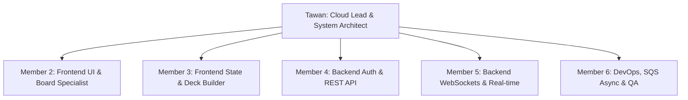

# 👥 DISNEY LORCANA PLAYLAB CLOUD - Team Work Distribution & Git Workflow

> **คู่มือการแบ่งหน้าที่ทีม 6 คน และการใช้งาน Git Version Control**  
> *โครงงานวิชา Cloud Technology (1/2569) KMITL IT*

---

## 🎯 1. การแบ่งโครงสร้างทีม 6 คน (Role Allocation & Responsibilities)

การแบ่งหน้าที่ออกเป็น 6 บทบาทที่ชัดเจน เพื่อให้ทุกคนมีขอบเขตงานเฉพาะทาง ไม่เหยียบเท้ากัน และทำงานควบคู่กันได้รวดเร็ว:



### 👤 1. ตะวัน (Team Lead & Cloud Architect)
*   **บทบาท:** หัวหน้าโปรเจกต์ & ผู้ดูแลสถาปัตยกรรมคลาวด์รวม
*   **หน้าที่หลัก:**
    *   ตั้งค่า Repository, กฎการ PR (Pull Request) และภาพรวมโครงสร้าง AWS Infrastructure
    *   ควบคุมดูแลลำดับการพัฒนาตามแผน MVP (Sprint 1–5) ให้ส่งทันตามกำหนด 3 Stage
    *   เป็นผู้รวมโค้ด (Code Reviewer) และเขียนรายงาน/สไลด์นำเสนอฉบับสมบูรณ์
*   **ไฟล์งานหลัก:** `PLAN_PROJECT.md`, `README.md`, เอกสาร Proposal/Report LaTeX, สไลด์นำเสนอ

### 👤 2. สมาชิกคนที่ 2 (Frontend Specialist 1 - UI & Lorcana Board)
*   **เครื่องมือ:** TypeScript, React 19, Tailwind CSS v4, Framer Motion
*   **หน้าที่หลัก:**
    *   สร้าง UI Layout กระดานซ้อมเล่น Lorcana Board (Play Area, Inkwell, Lore Tracker, Discard)
    *   พัฒนาระบบ Drag and Drop ลากวางการ์ดด้วย HTML5 Drag & Drop API
    *   ทำแอนิเมชันพลิกการ์ด (Flip) และหมุนการ์ดเอียง (Exert 90° / Ready 0°) ด้วย Framer Motion
*   **โฟลเดอร์รับผิดชอบ:** `src/components/board/`, `src/components/card/`, `src/assets/`

### 👤 3. สมาชิกคนที่ 3 (Frontend Specialist 2 - State & Deck Builder)
*   **เครื่องมือ:** TypeScript, React 19, Zustand, Chart.js
*   **หน้าที่หลัก:**
    *   ออกแบบและเขียน Global State Store ด้วย **Zustand** (จัดการการ์ดบนมือ, สเตตัสบอร์ด)
    *   พัฒนาหน้า UI **Deck Builder** สำหรับค้นหา กรองการ์ด 408 ใบ (Set 1 & 2) และสร้างกองการ์ด 60 ใบ
    *   เชื่อมต่อ Chart.js สำหรับวาดกราฟสถิติจุดร่าย Ink Distribution & Cost Curve
*   **โฟลเดอร์รับผิดชอบ:** `src/store/`, `src/components/deck/`, `src/components/charts/`

### 👤 4. สมาชิกคนที่ 4 (Backend Specialist 1 - Custom Auth & REST API)
*   **เครื่องมือ:** Node.js/Python Lambda, Amazon DynamoDB, JWT, API Gateway REST
*   **หน้าที่หลัก:**
    *   เขียน AWS Lambda Function สำหรับสมัครสมาชิกและลงรหัสผ่านด้วย `bcrypt`
    *   เขียน AWS Lambda Function สำหรับ Login และออก `JWT Token`
    *   ตั้งค่า **API Gateway Lambda Authorizer** สำหรับคัดกรอง Request ความปลอดภัย
    *   เขียน REST API (Lambda + DynamoDB) สำหรับระบบ CRUD เด็คการ์ด (`UsersTable`, `DecksTable`)
*   **โฟลเดอร์รับผิดชอบ:** `backend/auth/`, `backend/deck/`, `docs/api-spec.json`

### 👤 5. สมาชิกคนที่ 5 (Backend Specialist 2 - WebSockets & Real-time Room Sync)
*   **เครื่องมือ:** AWS API Gateway WebSockets, Lambda, DynamoDB (`RoomStateTable`)
*   **หน้าที่หลัก:**
    *   ตั้งค่า **AWS API Gateway WebSockets** (Routes: `$connect`, `$disconnect`, `sendmessage`)
    *   เขียน Lambda Function **Room Router** ซิงค์พิกัดบอร์ดและการกระทำระหว่าง 2 ผู้เล่น (<100ms)
    *   พัฒนาระบบ Auto-Reconnect ภายใน 30 วินาทีเมื่อสัญญาณหลุด
    *   เขียนไฟล์ Service ฝั่ง Frontend (`src/services/websocket.ts`) สำหรับเชื่อมต่อ WS
*   **โฟลเดอร์รับผิดชอบ:** `backend/room/`, `src/services/websocket.ts`

### 👤 6. สมาชิกคนที่ 6 (DevOps, Async Analytics & QA Tester)
*   **เครื่องมือ:** Amazon S3, Amazon SQS, AWS Lambda, AWS CloudWatch
*   **หน้าที่หลัก:**
    *   ตั้งค่า **S3 Event Trigger ➔ Amazon SQS Queue**
    *   เขียน Lambda Function **Deck Synergy Analyzer** ดึงคิวข้อความไปคำนวณวิเคราะห์เด็คเบื้องหลัง
    *   ตั้งค่า **AWS CloudWatch Dashboards & Billing Alarms ($0.00)**
    *   ทำ System E2E Testing, ตรวจสอบ Intext Reference ในเล่มรายงาน และดูแล QA
*   **โฟลเดอร์รับผิดชอบ:** `backend/analyzer/`, `scripts/`, เอกสาร Reference เล่มรายงาน

---

## 🌿 2. กลยุทธ์การใช้ Git Version Control (Git Branching Model)

เพื่อป้องกันไม่ให้โค้ดทับกัน หรือทำระบบพัง ทีมจะใช้กลยุทธ์ **GitHub Flow / Feature Branch Workflow**:

```
main        --------------------------------------------------------> [Production Ready]
              \                                                   /
develop        \-------------------------------------------------> [Integration Test]
                 \                 /             \             /
feature/branch    \-- [feature/ui] --/               \-- [auth] --/
```

### 📌 2.1 โครงสร้างสาขา (Branch Naming Convention)
*   **`main`**: กิ่งหลักสำหรับโค้ดที่ผ่านการทดสอบสมบูรณ์แล้วเท่านั้น (ห้าม Push ตรงเด็ดขาด)
*   **`develop`**: กิ่งกลางสำหรับรวมงานของทุกคนเข้าด้วยกันก่อนนำเสนออาจารย์
*   **`feature/ชื่อฟีเจอร์`**: กิ่งสำหรับพัฒนาแต่ละหน้าที่ เช่น:
    *   `feature/board-ui` (สมาชิกคนที่ 2)
    *   `feature/deck-builder` (สมาชิกคนที่ 3)
    *   `feature/lambda-auth` (สมาชิกคนที่ 4)
    *   `feature/websocket-sync` (สมาชิกคนที่ 5)
    *   `feature/async-sqs` (สมาชิกคนที่ 6)

---

### 🔄 2.2 กฎการทำงานร่วมกันผ่าน Git (Git Workflow Rules)

1.  **แตก Branch ใหม่จาก `develop` เสมอ:**
    ```bash
    git checkout develop
    git pull origin develop
    git checkout -b feature/board-ui
    ```
2.  **Commit งานเป็นระยะพร้อมข้อความที่ชัดเจน (Conventional Commits):**
    *   `feat: add Lorcana board layout component`
    *   `fix: resolve drag and drop card coordinate issue`
    *   `docs: update API endpoints spec`
3.  **สร้าง Pull Request (PR) เมื่อทำฟีเจอร์เสร็จ:**
    *   ส่ง PR จาก `feature/xxxx` ➔ เข้า `develop`
    *   ให้ตะวัน (Team Lead) หรือเพื่อนร่วมทีม 1 คนกด **Review & Approve** ก่อน Merge
4.  **วิธีแก้ไข Merge Conflict:**
    *   หากเกิด Conflict ให้ดึง `develop` ล่าสุดกลับมาแก้ไขในเครื่องตนเองก่อน:
    ```bash
    git checkout develop
    git pull origin develop
    git checkout feature/board-ui
    git merge develop
    # แก้ไขไฟล์ที่ขัดแย้งใน VS Code -> Save -> Commit -> Push
    ```

---

## 📅 3. สรุปหมุดหมายการส่งงานรายบุคคลตาม Stage (Stage Deliverables Checklist)

### 🎯 Stage 2 Milestone (ส่งรายงาน 10 ก.ย. 69 / นำเสนอ 22-26 ก.ย. 69)
*   **ตะวัน:** รวบรวมเอกสารรายงานบทที่ 2-3 และเตรียมสไลด์นำเสนอ 10 นาที
*   **สมาชิก 2 & 3:** กระดานซ้อมเล่น UI และระบบ Deck Builder ทำงานร่วมกับ Zustand สมบูรณ์
*   **สมาชิก 4:** AWS Lambda Auth + JWT และ REST API บันทึกเด็กรันบน AWS
*   **สมาชิก 5:** AWS API Gateway WebSockets ซิงค์พิกัดห้องเล่นเรียลไทม์ได้จริง

### 🎯 Stage 3 Milestone (ส่งรายงาน 10 ต.ค. 69 / นำเสนอไฟนอล 20-25 ต.ค. 69)
*   **สมาชิก 6:** ระบบ SQS Async Deck Analyzer ทำงานร่วมกับ S3 และ CloudWatch Dashboard
*   **ทุกคน:** ทำ End-to-End System Testing, รวมโค้ดขึ้น `main`, และตรวจเช็ก Intext Reference ในรายงาน
