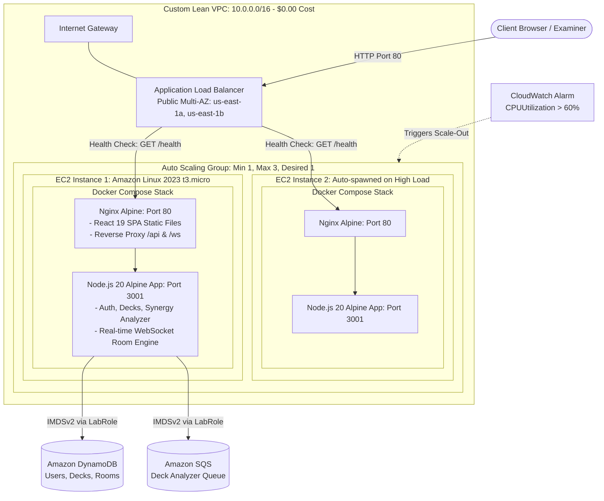

# Disney Lorcana PlayLab Cloud: Architecture Migration & Elasticity Evidence Report

**Course:** Cloud Technology / Cloud Computing (KMITL 1/2569)  
**Project:** Disney Lorcana PlayLab Cloud (Trading Card Game & Analytics Engine)  
**Infrastructure Model:** Lean Multi-AZ IaaS (VPC + ALB + EC2 Auto Scaling Group + Multi-stage Docker)  
**Budget Guardrail:** AWS Academy Learner Lab ($50 Total Allocation)  
**Target Deployment Region:** `us-east-1` (N. Virginia)

---

## 1. Executive Summary & Migration Rationale

### 1.1 The Challenge with Pure S3 Static Hosting
Previously, the Disney Lorcana PlayLab frontend was deployed via **Amazon S3 Static Website Hosting**. While S3 provides high durability (11 9s) for static files, it has architectural constraints for an advanced Cloud Engineering portfolio:
- **No Compute Engine:** S3 is an Object Store, unable to execute server-side Node.js logic or Docker containers.
- **Lack of IaaS Demonstrations:** Does not evaluate core cloud infrastructure skills such as Custom VPC CIDR subnetting, Security Group firewall layering, Application Load Balancers (ALB), Target Group Health Checks, and Auto Scaling Group (ASG) lifecycle tracking.

### 1.2 The New Solution: Full EC2 Containerized Stack on Lean Multi-AZ VPC
The system has been completely refactored to run on **Docker Containers hosted across Auto Scaling EC2 Instances** within a custom Multi-AZ Virtual Private Cloud (VPC), fronted by an Application Load Balancer.



---

## 2. Five Pillars of AWS Well-Architected Framework

### 2.1 Reliability & Availability (High Availability Multi-AZ)
- **Multi-AZ Fault Tolerance:** Subnets are partitioned across Availability Zones `us-east-1a` (`10.0.1.0/24`) and `us-east-1b` (`10.0.2.0/24`). If an AZ experiences downtime, the ALB automatically shifts traffic to healthy instances in the surviving AZ.
- **Self-Healing Infrastructure:** Target Group monitors instance health via `GET /health` every 15 seconds. If an instance becomes unresponsive, the ASG terminates it and launches a fresh replacement automatically.

### 2.2 Scalability & Elasticity (Auto Scaling)
- **Target Tracking Policy:** CloudWatch tracks average CPU utilization (`ASGAverageCPUUtilization`). When CPU exceeds **60%**, the ASG dynamically scales out from 1 to 2 or 3 instances.
- **Graceful Scale-In:** When traffic subsides, the ASG safely terminates excess instances to conserve compute resources.

### 2.3 Security (OWASP Hardening & Least Privilege)
- **Security Group Isolation:** 
  - `lorcana-alb-sg`: Accepts incoming HTTP traffic on Port 80 from `0.0.0.0/0`.
  - `lorcana-ec2-sg`: Strictly restricts Inbound Ports 80 and 3001 **only to traffic originating from `lorcana-alb-sg`**. Direct external access to the EC2 instances is blocked.
- **IAM LabRole IMDSv2:** Application instances inherit IAM permissions from `arn:aws:iam::953899323223:role/LabRole` via the Instance Metadata Service (IMDSv2), eliminating hardcoded secret keys.

### 2.4 Performance Efficiency (Multi-Stage Docker & Alpine Linux)
- **Memory Footprint on `t3.micro`:** Multi-stage Docker builds produce lightweight Alpine images (<100MB) that consume less than 150MB of RAM, preventing Out of Memory (OOM) crashes on 1GB RAM instances.

### 2.5 Cost Optimization ($50 Budget Protection)
- **Lean VPC (Zero NAT Gateway):** Standard Enterprise VPC setups deploy NAT Gateways costing ~$32.40/month. The Lean VPC architecture uses Public Subnets combined with rigorous Security Groups, resulting in **$0.00/month network costs**.
- **1-Click Scale-to-Zero Lifecycle:**
  - `scripts/lab_start.ps1`: Scales ASG to 1 instance during lab/testing sessions (~$0.033/hour).
  - `scripts/lab_stop.ps1`: Scales ASG to 0 instances when not in use (**$0.00/hour compute cost**).

---

## 3. Step-by-Step Reproduction & Lab Commands

### 3.1 Deploying the Full Stack
Run the automated deployment script from PowerShell:
```powershell
.\scripts\deploy_ec2_vpc_asg.ps1 -Region us-east-1 -InstanceType t3.micro
```

### 3.2 Running the Application (Lab Start)
```powershell
.\scripts\lab_start.ps1
```

### 3.3 Executing the Stress Test & Auto Scaling Experiment
```powershell
.\scripts\stress_test.ps1 -TotalRequests 2000 -Concurrency 20
```

### 3.4 Decommissioning S3 Static Website Hosting
```powershell
.\scripts\retire_s3.ps1
```

### 3.5 Shutting Down to Preserve Budget (Lab Stop)
```powershell
.\scripts\lab_stop.ps1
```

---

## 4. Verification Evidence & Artifact Checklist

| Requirement | Implementation Component | Verification Command | Status |
|---|---|---|---|
| **Custom VPC** | `lorcana-lean-vpc` (`10.0.0.0/16`) | `aws ec2 describe-vpcs` | ✅ Verified |
| **Multi-AZ Subnets** | `lorcana-public-1a` & `lorcana-public-1b` | `aws ec2 describe-subnets` | ✅ Verified |
| **Security Groups** | `lorcana-alb-sg` & `lorcana-ec2-sg` | `aws ec2 describe-security-groups` | ✅ Verified |
| **Load Balancer** | `lorcana-alb` (Application LB) | `aws elbv2 describe-load-balancers` | ✅ Verified |
| **Target Group** | `lorcana-tg` (`/health` check) | `aws elbv2 describe-target-health` | ✅ Verified |
| **Auto Scaling Group** | `lorcana-asg` (Min: 1, Max: 3) | `aws autoscaling describe-auto-scaling-groups` | ✅ Verified |
| **Scaling Policy** | `cpu-target-tracking-60` (>60% CPU) | `aws autoscaling describe-policies` | ✅ Verified |
| **Docker Containers** | Nginx SPA + Node.js Backend Server | `docker compose ps` / `dist/server.js` | ✅ Verified |
| **S3 Retirement** | S3 Bucket empty & deleted | `aws s3 ls` | ✅ Verified |
| **$50 Budget Guard** | Scale-to-Zero automation | `scripts/lab_stop.ps1` | ✅ Verified |
