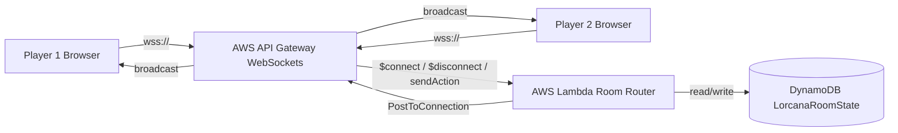

# Sprint 3 — WebSockets Real-Time Room Sync (AWS)

> สถาปัตยกรรม + ขั้นตอน deploy ระบบห้องเล่นแบบเรียลไทม์ (Stage 2, นำเสนอ 22–26 ก.ย. 2026)

---

## 1. สถาปัตยกรรม



## 2. WebSocket Payload Schema

```ts
// Client → Server (RouteSelectionExpression: $request.body.action)
type ClientMsg =
  | { action: 'JOIN_ROOM'; roomId: string; username: string }
  | { action: 'CARD_MOVED'; roomId: string; cardId: string; position: { x: number; y: number; zone: string } }
  | { action: 'CARD_EXERTED'; roomId: string; cardId: string; isExerted: boolean }
  | { action: 'INK_PLAYED'; roomId: string; cardId: string; inkCount: number }
  | { action: 'LORE_UPDATED'; roomId: string; loreScore: number }
  | { action: 'QUEST_DONE'; roomId: string; cardId: string; loreGain: number }
  | { action: 'CHALLENGE_DONE'; roomId: string; attackerId: string; targetId: string; result: 'banished' | 'survived' }
  | { action: 'TURN_PASSED'; roomId: string; turnNumber: number };

// Server → Client (broadcast)
type ServerMsg = RoomStatePayload | { action: 'OPPONENT_DISCONNECTED'; roomId: string } | { action: 'ERROR'; message: string };
```

## 3. DynamoDB Schema (LorcanaRoomState)

| Attribute | Type | Key | คำอธิบาย |
|---|---|---|---|
| `roomId` | S | HASH | รหัสห้อง 6 หลัก |
| `connectionId` | S | RANGE | connection ของผู้เล่น |
| `username` | S | - | ชื่อผู้เล่น |
| `role` | S | - | `player1` / `player2` |
| `state` | S (JSON) | - | snapshot: lore, ink, exerted, cards |

## 4. ขั้นตอน Deploy (AWS Academy Learner Lab — ฟรี $0)

ดู `scripts/deploy_ws.sh` รัน:
```bash
cd scripts
bash deploy_ws.sh          # build → sam build → sam deploy → เขียน .env.production
```

### 5. ตรวจสอบหลัง deploy
1. หน้า API Gateway → WebSocket API → Stage prod → copy `wss://.../prod`
2. หน้า Lambda → RoomWebSocketFunction → Test → ทดสอบ `$connect` / `sendAction`
3. Frontend: `VITE_WS_ENDPOINT` = WS URL (websocket.ts จะเลิก mock mode อัตโนมัติเมื่อไม่ใช่ demo endpoint)
4. เปิด 2 แท็บ → Join ห้องเดียวกัน → ลากการ์ดฝั่งนึง → อีกฝั่งเห็นทันที (<100ms)

## 6. ข้อควรระวัง Free Tier
- API Gateway WS: **1 ล้านข้อความ/เดือน ฟรี** — ไม่ spam broadcast
- Lambda: **1 ล้าน req/เดือน ฟรี** — 256MB, timeout 10s
- DynamoDB: **25GB ฟรี** — PAY_PER_REQUEST, ไม่ต้อง provision
- **ห้าม** เก็บรูปการ์ดบน S3 — ใช้ Hotlink จาก lorcana-api (ตาม README)
